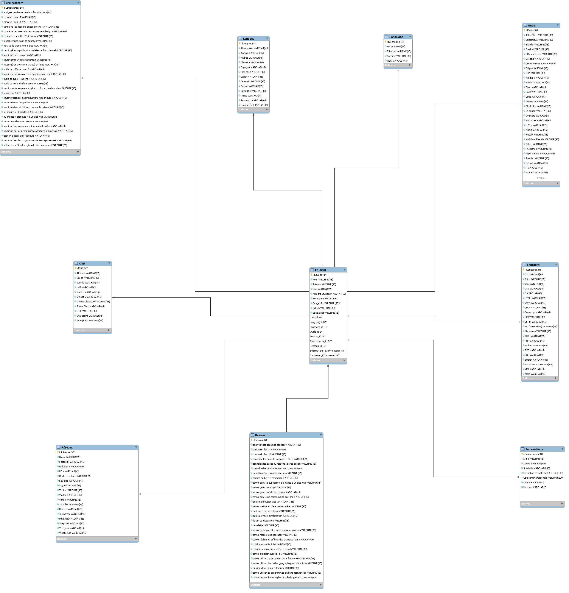

# Langages et Développement web.
## Groupe 2
Le groupe est composé de:
  - Bastien PELMARD / Baste95
  - Naushad-Ali SOOKUN / N-Ali
  - Thierry WEN / Yrrieth
  - Abdelrahim BOUCHIHA / anas0dev
  
  # Lien
  Lien du projet : https://n-ali.github.io/Groupe2_LangagesEtDevWeb  
  Lien du template : https://n-ali.github.io/Groupe2_LangagesEtDevWeb/template/index.html

# Nouvelles Fonctionnalitées
### Infine Scroll

> Fonctionnemet de l'Infinte Scroll.

Ajout de la fonctionnalité Infinite Scroll qui permettra d'avoir un site plus fluide. 
Au lieu de charger tout les étudiants, nous en chargerons par exemple 20. Lorsque nous arriverons à la fin, la page chargera les 20 étudiants suivants.

### Filtrage des données

> Fonctionnemet d'un filtreur de données.

Ajout d'un filtreur de données.
Avec un filtrage de données nous pourons par exempler trouver les éleves de M1 CEN qui parlent anglais et qui connaissent le JavaScript.

### Voice Bot

> Voice Bot pour malvoyant

Ajout d'un Voice Bot dans le projet.
Celui ci servira à entendre les informations d'un profil lorque l'on clique sur un bouton.

### Dark mode

:no_upscale()/cdn.vox-cdn.com/uploads/chorus_image/image/59849165/BF5E7325_709C_4BE3_BDDD_6AA50A7FF4E4.0.gif)
> Passage en Dark Mode sur le site **Reddit**

Fonctionnalité à la mode en ce moment, le Dark Mode permet de modifier visuellement le site.

### Changement de disposition

> Changement de disposition sur le site **Reddit**

Offrir a l'utilisateur de pouvoir changer la disposition des élements sur la page comme par exemple une disposition classique avec les information et une photo, une disposition compacte sans photo et une disposition avec seulement les photos et les noms.

### Tri par ordre alphabétique

> Option de tri sur **Exel**

Ajouté une option de tri par ordre alphabétique sur les étudiants

### Modifier un profil

> Option pour modifier un profil sur **Instagram**

Ajouté une option pour modifier les informations d'un profil, par exemple modifier l'adresse mail d'un étudiant 

### Supprimer un profil

> Croix pour illustrer la suppression 

Ajouté une option dans le projet pour supprimer un profil 

### Schémas de la base de données 

> Model de base de données.

Le model de la base de données de Trombino réalisé avec MySql Workbench 

> Lien vers Google spreadsheet 

(https://docs.google.com/spreadsheets/d/1ca31EthCMGs7qUWM0bWkA11JtoK3GupV0tU6wvrsN5Q/edit?usp=sharing)

google spreadsheet 
